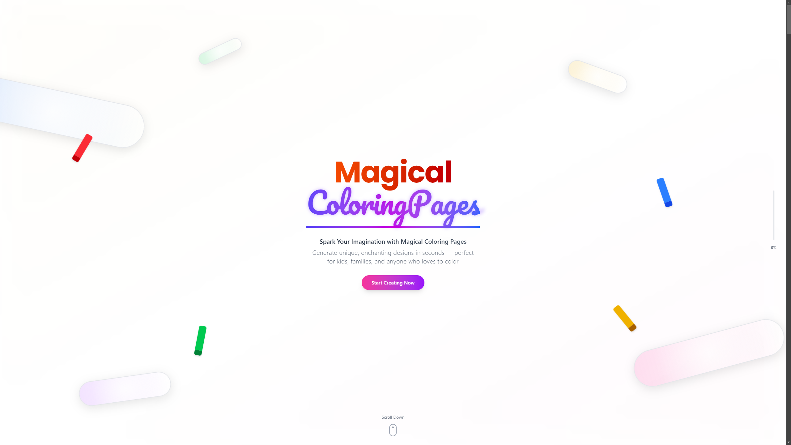

# ColorAI - AI-Powered Coloring Page Generator

ColorAI is an interactive web application that allows users to create, edit, and share coloring pages. Powered by AI, it transforms text descriptions or uploaded images into beautiful coloring pages that can be customized and printed.



## 🌐 Live Demo

Visit the live application at [colormewithai.vercel.app](https://colormewithai.vercel.app)

## ✨ Features

- **AI-Powered Generation**: Create coloring pages from text descriptions
- **Image Upload**: Convert your own images into coloring pages
- **Edit & Customize**: Zoom, rotate, and pan to perfect your coloring pages
- **User Dashboard**: Manage all your created coloring pages
- **Gallery**: Browse and get inspired by community-created coloring pages
- **Favorites**: Save coloring pages you love for easy access
- **Dark Mode**: Comfortable viewing experience in any lighting condition

## 🚀 Getting Started

This is a [Next.js](https://nextjs.org) project. To run it locally:

```bash
# Clone the repository
git clone https://github.com/yourusername/word-blast.git
cd word-blast

# Install dependencies
npm install

# Run the development server
npm run dev
```

Open http://localhost:3000 in your browser to see the game in action.

## 🛠️ Technologies Used

- **Frontend**: Next.js 15, React 19, TailwindCSS 4
- **Animation**: GSAP, Lenis for smooth scrolling
- **State Management**: React Hooks, SWR for data fetching
- **Authentication**: Supabase Auth
- **Database**: Supabase
- **Styling**: TailwindCSS with dark mode support
- **Icons**: Lucide React

## 🔐 Environment Variables

To run this project, you'll need to set up the following environment variables in a `.env.local` file at the root of your project:

### Required Variables:

- `NEXT_PUBLIC_SUPABASE_URL`: Your Supabase project URL
- `NEXT_PUBLIC_SUPABASE_ANON_KEY`: Your Supabase anonymous key for client-side authentication
- `GEMINI_API_KEY`: Google's Gemini API key for AI image generation

To obtain these keys:

1.  Create a Supabase project at [supabase.com](https://supabase.com)
2.  Get a Gemini API key from [Google AI Studio](https://makersuite.google.com/app/apikey)

⚠️ **Important**: Never commit your `.env.local` file to version control. It's already included in `.gitignore` to prevent accidental exposure of your API keys.

## 📁 Project Structure

    coloring-image/
    ├── app/                # Next.js app directory
    │   ├── api/            # API routes
    │   ├── auth/           # Authentication pages
    │   ├── components/     # Shared components
    │   ├── create/         # Page creation flows
    │   ├── dashboard/      # User dashboard
    │   ├── edit/           # Coloring page editor
    │   ├── gallery/        # Community gallery
    │   ├── hooks/          # Custom React hooks
    │   └── services/       # API service functions
    ├── components/         # Global UI components
    │   ├── auth/           # Authentication components
    │   ├── providers/      # Context providers
    │   ├── sections/       # Page sections
    │   └── ui/             # UI components
    ├── lib/                # Utility functions
    ├── public/             # Static assets
    │   ├── images/         # Image assets
    │   └── sounds/         # Sound assets
    └── utils/              # Helper utilities
    └── supabase/           # Supabase client utilities

## 🤝 Contributing

Contributions are welcome! If you'd like to contribute:

1. Fork the repository
2. Create a feature branch ( git checkout -b feature/amazing-feature )
3. Commit your changes ( git commit -m 'Add some amazing feature' )
4. Push to the branch ( git push origin feature/amazing-feature )
5. Open a Pull Request

## 📝 License

This project is licensed under the MIT License - see the LICENSE file for details.
